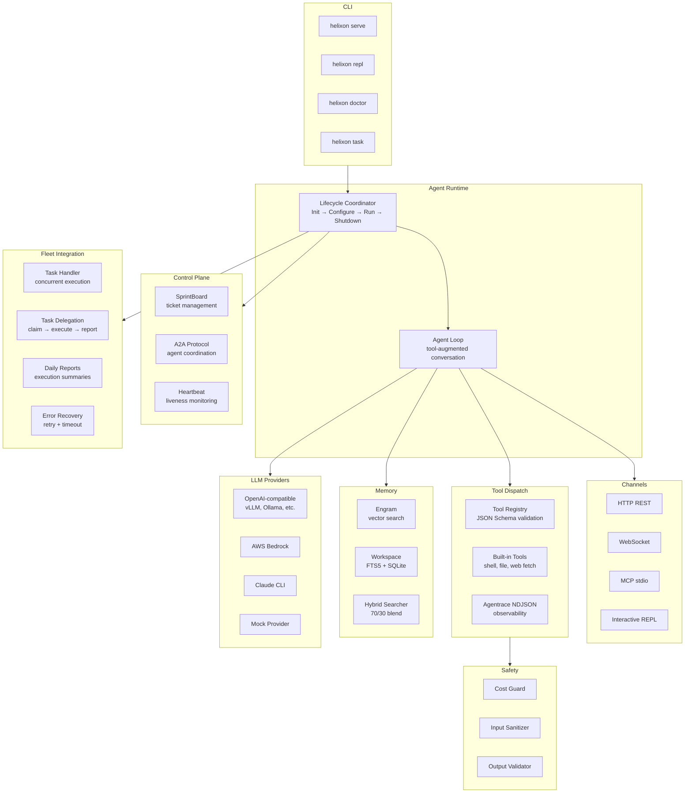

# Helixon Platform

A production-ready Go agent runtime for building autonomous AI agents with
tool dispatch, multi-channel communication, hybrid memory, and lifecycle management.

Built on [cloudwego/eino](https://github.com/cloudwego/eino) for LLM orchestration
with callback-driven observability.

## Architecture



## Features

- **Agent runtime** with full lifecycle management (Init → Configure → Run → Shutdown)
- **Tool dispatch** with built-in tools (shell, file read/write, web fetch) and extensible registry with JSON Schema validation
- **Multi-channel input**: HTTP REST, WebSocket, MCP stdio, interactive REPL
- **LLM providers**: OpenAI-compatible (vLLM, Ollama, LM Studio), AWS Bedrock, Claude CLI, mock
- **Hybrid memory**: Engram vector search + FTS5 SQLite with configurable blending
- **Fleet integration**: A2A protocol handler, concurrent task execution, retry logic, daily reports
- **Control plane**: SprintBoard ticket management, heartbeat monitoring, agent coordination
- **Safety layer**: cost guards, input sanitisation, output validation
- **Observability**: Agentrace NDJSON events, OpenTelemetry callbacks, Prometheus metrics
- **Evaluation framework**: suite runner with pass/fail/warn verdicts and NDJSON reporting
- **Platform server**: HTTP/SSE server for browser and API access

## Quick Start

### Install

```bash
go install github.com/nfsarch33/helixon-platform/cmd/helixon@latest
```

### Build from source

```bash
git clone https://github.com/nfsarch33/helixon-platform.git
cd helixon-platform
go build -o helixon ./cmd/helixon
```

### Run

```bash
# Health check (no config required)
./helixon doctor

# Interactive REPL with echo mode (no LLM required)
./helixon repl

# Interactive REPL with LLM
./helixon repl --config helixon.yaml

# Start the runtime with HTTP channel
./helixon serve --config helixon.yaml --http-addr :8686

# Start the platform HTTP/SSE server
./helixon platform --addr 127.0.0.1:8787

# Execute a SprintBoard ticket
./helixon task --config helixon.yaml --ticket T-1234

# Execute a direct prompt
./helixon task --config helixon.yaml --prompt "Summarise the project status"
```

## Configuration

Create a `helixon.yaml`:

```yaml
agent_id: my-agent
system_prompt: "You are a helpful autonomous agent."
session_dsn: "file:helixon.db?cache=shared&mode=rwc"
max_iterations: 25
max_tokens: 128000
timeout: 5m
heartbeat_every: 60s

provider:
  kind: openai-compat
  base_url: http://127.0.0.1:8787/v1
  model: Qwen3-4B
  api_key: "${OPENAI_API_KEY}"
  timeout: 30s

sprintboard:
  url: http://127.0.0.1:9400
  capabilities: "code,test,review"
```

See [`examples/`](examples/) for more configuration examples.

### Provider kinds

| Kind | Description | Required fields |
|------|-------------|-----------------|
| `openai-compat` / `openai` | Any OpenAI-compatible API (vLLM, Ollama, LM Studio) | `base_url`, `model` |
| `mock` | Returns canned responses for testing | (none) |
| `none` / empty | Echo mode, no LLM | (none) |

### Environment variable expansion

API keys support `${ENV_VAR}` syntax so secrets stay out of YAML files:

```yaml
provider:
  api_key: "${OPENAI_API_KEY}"
```

## HTTP API

| Endpoint | Method | Description |
|----------|--------|-------------|
| `/api/v1/chat` | POST | Send message, get response |
| `/api/v1/health` | GET | Health check |
| `/api/v1/fleet/tasks` | POST | Submit a fleet task |
| `/api/v1/fleet/tasks` | GET | List all fleet tasks |
| `/api/v1/fleet/tasks/{id}` | GET | Get task status |
| `/api/v1/dashboard` | GET | Runtime dashboard |

## Project Structure

```
cmd/helixon/                CLI binary (serve, doctor, repl, platform, task)
internal/
  helixon/                  Core runtime, config, lifecycle, channels
    agent/                  Agent loop and session management (SQLite + FTS5)
    builtins/               Built-in tool implementations (shell, file, web)
    channel/                Transport adapters (MCP stdio, REPL, webhook)
    controlplane/           SprintBoard client, heartbeat, A2A client
    dashboard/              HTTP dashboard views (workload, CI/CD, sprint)
    fleet/                  Fleet task handler, delegation, reports, retry
    memory/                 Engram, Mem0, workspace, hybrid memory
    platform/               HTTP/SSE platform server
    safety/                 Cost guards, validation, sanitisation
    tooldispatch/           Tool registry, JSON Schema validation, agentrace
  callbacks/                Callback handlers (NDJSON, OTel, Prometheus, Mem0)
  evalfw/                   Evaluation framework (suite runner, reporter)
  llm/                      LLM provider abstraction (client, router, streaming)
```

## Development

### Prerequisites

- Go 1.22+ (tested with Go 1.25.6)
- SQLite support via `modernc.org/sqlite` (pure Go, no CGO required)

### Build and test

```bash
go build ./...
go test -race -cover ./...
go vet ./...
```

### Run tests with coverage threshold

```bash
go test -race -coverprofile=coverage.txt ./...
total=$(go tool cover -func=coverage.txt | grep total | awk '{print $3}' | tr -d '%')
echo "Coverage: ${total}%"
```

### Lint

```bash
golangci-lint run ./...
govulncheck ./...
```

## Built-in Tools

| Tool | Description |
|------|-------------|
| `shell_exec` | Execute shell commands |
| `file_read` | Read file contents |
| `file_write` | Write file contents |
| `web_fetch` | Fetch URL contents |

### Register custom tools

```go
registry.Register(tooldispatch.ToolDef{
    Name:        "my_tool",
    Description: "Does something useful",
    Parameters:  json.RawMessage(`{"type":"object","properties":{"input":{"type":"string"}},"required":["input"]}`),
    Handler: func(ctx context.Context, args map[string]any) (string, error) {
        input := args["input"].(string)
        return "result: " + input, nil
    },
    Timeout: 30 * time.Second,
})
```

## Fleet Integration

The fleet package enables multi-agent task delegation:

```go
handler := fleet.NewHandler(executor, sprintboardClient, fleet.HandlerConfig{
    MaxConcurrent:  4,
    DefaultTimeout: 10 * time.Minute,
    MaxRetries:     2,
})

// Register HTTP routes
mux := http.NewServeMux()
handler.RegisterRoutes(mux)

// Submit tasks programmatically
taskID, _ := handler.Submit(ctx, fleet.TaskSubmission{
    AgentName: "worker-1",
    Prompt:    "Review the PR and fix lint issues",
    TicketID:  "T-1234",
})

// Generate daily reports
report := fleet.GenerateDailyReport("fleet-1", handler.ListTasks(), dayStart, dayEnd)
fmt.Println(fleet.FormatReport(report))
```

## Contributing

See [CONTRIBUTING.md](CONTRIBUTING.md) for guidelines.

## License

[MIT](LICENSE)
