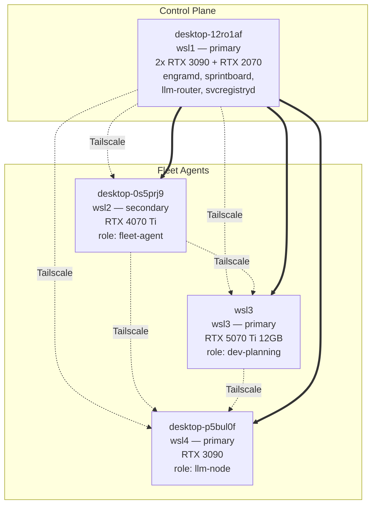

# runx-leak-scan: allow-file internal_ip
# Helixon k3s Cluster Diagram (v14563)

## Node list

| Hostname | Role | Tier | GPU | Internal IP | Tailscale IP |
|----------|------|------|-----|-------------|--------------|
| desktop-12ro1af (wsl1) | control-plane | primary | (none) | 172.29.144.56 | 100.84.108.92 |
| desktop-0s5prj9 (wsl2) | fleet-agent   | secondary | (none) | 192.168.4.64  | 100.110.82.5 |
| desktop-p5bul0f (wsl4) | llm-node      | primary | rtx3090 | 100.79.227.40 | 100.79.227.40 |
| wsl3                | dev-planning  | primary | rtx5070ti | 172.20.113.115 | 100.73.98.10  |

## Connectivity (verified via Tailscale)
- All 4 nodes are online and reachable
- All 4 nodes have helm-style labels for `helixon.io/*`
- wsl3 newly joined in v14563 (4m runtime)
